# trading-platform-stp

A multi-agent, gen-AI-assisted **straight-through processing (STP) trading platform** — market
data ingestion, a deterministic bar-by-bar paper-trading replay engine, rules-based risk and
compliance surveillance, technical analytics, and full Prometheus/Grafana observability.


[](https://github.com/thompgt/trading-platform-stp/actions/workflows/ci.yml)

---

## Why this matters

A trade is not done when it is executed. Between an order being entered and cash actually
moving there are a dozen handoffs — pre-trade risk, routing, execution, allocation,
affirmation, clearing and margin, settlement, reconciliation, regulatory reporting. In many
firms a meaningful share of those handoffs are still manual: someone re-keys an allocation,
someone emails a custodian about a break, someone eyeballs a blotter for suspicious patterns.

**Straight-through processing** is the goal of removing those manual touchpoints so an order
flows from entry to settled position without human re-keying. It matters because every manual
touch is a place where the trade can be late (T+1 leaves very little room to fix a fail),
wrong (fat-finger and re-keying errors), expensive (fails carry funding and buy-in costs), or
unauditable (a decision made in an inbox is not a decision anyone can reconstruct later).

The hard part is that "fully automated" and "safely automated" pull against each other. Risk
gates, compliance filings and settlement instructions are exactly the places where you cannot
let a black box act unsupervised. This repo is a working exploration of that tension:

- **Automate the deterministic parts.** Risk limits, compliance pattern detection, P&L,
  drawdown, indicators and signals are pure functions of cached market data. Same inputs,
  same outputs, every time — so any number on screen can be re-derived and defended.
- **Use gen-AI only where a human still signs.** The LLM agents propose a strategy, answer a
  research question over supplied facts, or draft a triage narrative for an alert that
  *deterministic code already raised*. The model never detects the violation, never files
  anything, and never emits executable code — it fills in parameters for strategy shapes the
  engine already knows how to run.
- **Instrument everything.** If a pipeline runs without humans watching each step, the
  monitoring is the control. Service health and trading P&L are on the same dashboard, so
  "is the platform healthy" and "what is the platform doing" are one question.

The full design — the complete agent roster, trade lifecycle, settlement and margin workflows,
target AWS platform, and phased roadmap — lives in **[workplan.md](./workplan.md)**. This
README describes what is actually built and running.

---

## Skills demonstrated

**Backend / API**
- Node.js 20+ ESM, **Express 5** with a router-per-domain layout and a JSON-only last-resort
  error handler that never quotes internals back to a caller
  (`backend/src/middleware/errors.js`)
- Dependency-injected app factory (`createApp(db)`) so the whole API is testable in-process
  with **supertest**, no listening socket required

**Data engineering**
- **DuckDB** as an embedded analytical store; promise wrapper over the callback driver,
  idempotent `INSERT OR REPLACE` upserts keyed on `(symbol, ts)`, schema bootstrap on boot
- Batched, transactional ingestion — 500 rows per statement inside one transaction, so an
  intraday range does not queue tens of thousands of sequential writes on the single shared
  connection, and a failed ingest leaves no partial range behind
- Third-party market data ingestion from **Yahoo Finance** (`yahoo-finance2`), daily through
  5-minute intraday bars, with BigInt→Number normalization at the boundary

**Quantitative / analytics**
- Indicator library written from scratch — SMA, EMA (with seeding), RSI, MACD, Bollinger
  bands and %B, ATR — with explicit warm-up windows and no silent period shortening
- Performance analytics: equity curve, cumulative and realized P&L, max drawdown, Sharpe,
  Sortino, volatility, win rate, profit factor, exposure, with annualization inferred from
  observed bar spacing
- A deterministic replay/backtest engine with cursor semantics (step / rewind /
  jump-to-date / reset), re-running the strategy from bar zero on every action

**Gen-AI engineering**
- **Groq** (`llama-3.3-70b-versatile` by default) behind a shared JSON-mode call wrapper
- **`zod` on both sides of the boundary**: every request body is parsed by a schema in one
  middleware (`middleware/validate.js`, `schemas/requests.js`) before a handler sees it, and
  every LLM response is parsed before a caller does
- **Structured output enforcement with `zod`**: schema-validated on every response, with
  validation errors fed *back* to the model for a bounded retry, and a typed
  `LlmValidationError` if it never converges — unvalidated model output can never reach a
  caller (`backend/src/agents/llmJson.js`)
- Bounded upstream calls: a per-request `AbortSignal` plus an overall deadline across retries,
  surfaced as a typed `LlmTimeoutError` → HTTP 504 and its own Prometheus outcome, kept
  separate from schema failures because the remedy differs
- Guardrail design: models propose parameters, never code; patterns are detected by rules and
  only *narrated* by the model; drafts are labelled and marked pending human review

**Frontend**
- **React 19 + Vite 8** SPA, `react-router-dom` routing, hand-rolled SVG charts (line series,
  bar, donut, sparkline, meter) with no charting dependency
- Per-route `ErrorBoundary` keyed by pathname, live backend health indicator, polling with
  stale-data retention when the backend goes away

**Observability**
- `prom-client` instrumentation: HTTP RED metrics labelled by **matched route pattern** (not
  raw URL — replay paths carry session UUIDs), Node process/event-loop metrics, DuckDB query
  timing, upstream fetch latency by outcome, per-agent LLM latency and outcomes, plus live
  trading gauges (equity, P&L, drawdown, exposure, Sharpe)
- **Prometheus + Grafana in Docker Compose**, fully file-provisioned (datasource and dashboard
  live in git, exist on first boot)

**Testing**
- **Vitest** on both sides — 35 backend suites, 13 frontend suites; Groq is mocked so the LLM
  paths are testable without an API key; **Testing Library** + jsdom for components and pages

---

## Architecture

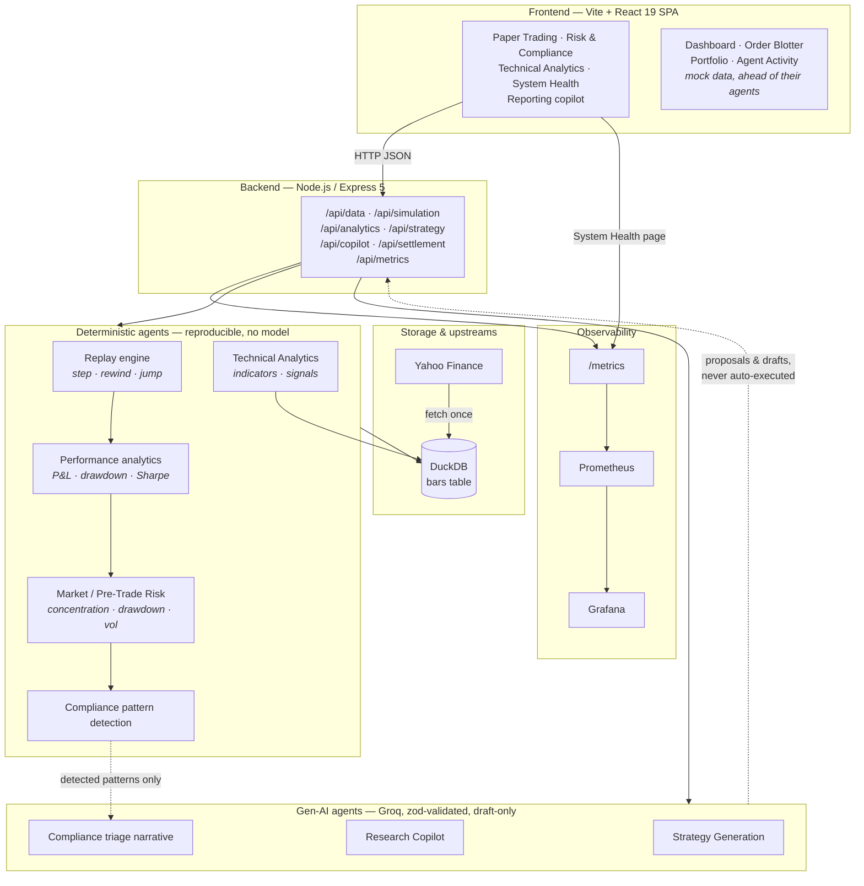

Two properties the diagram is meant to make obvious:

- **Gen-AI has no write path to anything irreversible.** Groq agents return proposals and
  drafts through the API; a human accepts them. Compliance patterns are detected
  deterministically first, and the model only writes the narrative explaining an alert code
  already raised.
- **Every claimed number is deterministic.** Signals, risk alerts, P&L and the replay itself
  are pure functions of the cached bars.

### Models

There is no trained ML model anywhere in this repo. "Model" here means three distinct things,
kept deliberately separate.

**1. Persistence model — DuckDB** (`backend/src/db/duckdb.js`)

```sql
CREATE TABLE IF NOT EXISTS bars (
  symbol  VARCHAR   NOT NULL,
  ts      TIMESTAMP NOT NULL,
  open    DOUBLE,
  high    DOUBLE,
  low     DOUBLE,
  close   DOUBLE,
  volume  BIGINT,
  PRIMARY KEY (symbol, ts)
)
```

One table. The composite primary key makes re-fetching an overlapping range idempotent
(`INSERT OR REPLACE`), which is what lets ingestion be retried freely. Everything else in the
system — trades, equity curves, risk alerts, signals — is *derived* from these rows at request
time and is not persisted, which is why the whole platform is reproducible from the bar cache
alone.

**2. Domain models** (in-memory, plain JS objects)

| Model | Shape | Where |
|---|---|---|
| `Bar` | `{ symbol, ts, open, high, low, close, volume }` | `data/marketData.js` |
| `Strategy` | `{ kind: 'sma_crossover' \| 'rsi_threshold', params }` — params are `{ fastPeriod, slowPeriod }` or `{ period, oversold, overbought }` | `simulation/strategyRunner.js` |
| `Trade` | `{ ts, side: 'BUY' \| 'SELL', qty, price }` | `simulation/strategyRunner.js` |
| `EquityPoint` | `{ ts, equity }` | `simulation/strategyRunner.js` |
| `SessionState` | `{ cursor, length, isAtEnd, currentBar, trades, equityCurve, cash, position }` | `simulation/engine.js` |
| `RiskAlert` | `{ id, severity: high\|medium\|low, agent, message, time }` | `agents/riskEngine.js` |
| `CompliancePattern` | `{ id, pattern, severity, facts[] }` (deterministic) | `agents/complianceAgent.js` |
| `ComplianceDraft` | `{ id, severity, pattern, symbol, status, aiDraft }` (LLM-narrated) | `agents/complianceAgent.js` |
| `Signal` | `{ indicator, direction, strength, … }` plus a parallel `skipped[]` with reasons | `analytics/signals.js` |

Sessions live in an in-memory `Map` keyed by a `randomUUID()` session id.

**3. LLM contract models — `zod` schemas**

Every Groq response is parsed against a schema before anything downstream sees it:

| Schema | Agent | Fields |
|---|---|---|
| `StrategySchema` | Strategy Generation | `name`, `rationale`, `kind` (enum), `params` (bounded-range union) |
| `TriageSchema` | Compliance Surveillance | `explanation`, `recommendation` |
| `CopilotAnswerSchema` | Research Copilot | `answer`, `usedFacts[]` |

`StrategySchema` deliberately mirrors exactly what `strategyRunner.js` can execute, with
integer and range bounds on every parameter, plus cross-field checks (`fastPeriod < slowPeriod`,
`oversold < overbought`) after validation. The model chooses numbers inside a shape the engine
already understands — nothing it emits is ever `eval`'d.

**4. Quant models** — the deterministic math: SMA/EMA/RSI/MACD/Bollinger/ATR
(`analytics/indicators.js`), the signal rules (`analytics/signals.js`), Sharpe/Sortino/
drawdown/exposure (`analytics/performance.js`), and the risk limits
(`agents/riskEngine.js`, `DEFAULT_LIMITS`: concentration 40%/70%, drawdown 5%/15%, daily vol
2%/4%).

### Component layout

```
trading-platform-stp/
├─ backend/                       Node.js 20+ · Express 5 · ESM
│  └─ src/
│     ├─ server.js                entrypoint: env, DuckDB open + schema, listen
│     ├─ app.js                   createApp(db, {apiKey, corsOrigins}) — CORS allowlist, JSON,
│     │                           metrics middleware, API-key auth, routers
│     ├─ middleware/              auth.js (API key) · rateLimit.js (fixed-window, LLM routes)
│     │                           validate.js (zod request bodies)
│     ├─ schemas/requests.js      every accepted request body, in one place
│     ├─ lib/expiringStore.js     TTL + LRU map behind the session and settlement stores
│     ├─ routes/
│     │  ├─ data.js               GET /symbols · POST /fetch · GET /bars/:symbol
│     │  ├─ simulation.js         session lifecycle, step/rewind/jump/reset, DELETE, perf, risk, compliance
│     │  ├─ analytics.js          GET /signals (bounded lookback, memoized) · GET /indicators/:symbol
│     │  ├─ strategy.js           POST /generate            (Groq)
│     │  ├─ copilot.js            POST /ask                 (Groq)
│     │  ├─ settlement.js         POST /run (server-minted runId) · GET /runs
│     │  │                        GET/DELETE /:runId[/ledger|/breaks|/report.pdf]
│     │  └─ metrics.js            GET /metrics (Prom text) · GET /api/metrics/summary (JSON)
│     ├─ agents/
│     │  ├─ groqClient.js         lazy Groq SDK client + GROQ_MODEL
│     │  ├─ llmJson.js            JSON-mode call + zod validation + retry + LlmValidationError
│     │  ├─ strategyAgent.js      Strategy Generation  (gen-AI, proposal-only)
│     │  ├─ copilotAgent.js       Research Copilot     (gen-AI, grounded in supplied facts)
│     │  ├─ complianceAgent.js    rules detect patterns → Groq drafts triage narrative
│     │  └─ riskEngine.js         Pre-Trade / Market Risk  (rules only, no model)
│     ├─ analytics/               indicators.js · signals.js · performance.js
│     ├─ posttrade/               procedure.js (5-stage settlement run) · money.js (integer cents)
│     │                           ledger.js (double-entry) · calendar.js (T+1 NYSE) · matching.js
│     │                           enrichment.js · settlement.js (DVP) · positions.js
│     │                           reconciliation.js · report.js · pdf.js · staticData.js
│     ├─ simulation/              engine.js (cursor replay) · strategyRunner.js (execution)
│     ├─ data/marketData.js       Yahoo fetch · DuckDB upsert/load · cached-symbol listing
│     ├─ db/duckdb.js             promise wrapper + `bars` schema
│     └─ metrics/                 registry.js (all metric definitions) · httpMetrics.js
│  └─ test/                       29 Vitest suites (Groq mocked — no API key needed)
│
├─ frontend/                      React 19 · Vite 8 · react-router-dom
│  └─ src/
│     ├─ main.jsx / App.jsx       9 routes, each wrapped in an ErrorBoundary keyed by path
│     ├─ pages/                   Dashboard · OrderBlotter · Portfolio · RiskCompliance
│     │                           Reporting · Analytics · PaperTrading · AgentActivity
│     │                           SystemHealth
│     ├─ components/              Sidebar · ErrorBoundary · ui.jsx
│     │  └─ charts/               LineSeriesChart · BarChart · DonutChart · Sparkline · Meter
│     ├─ api/                     client.js (fetch + ApiError) · backend.js (endpoint bindings)
│     │                           useBackendHealth.js (live online/offline indicator)
│     └─ data/mockData.js         placeholder data for pages ahead of their backend agents
│
├─ monitoring/                    observes the backend; backend itself runs on the host
│  ├─ docker-compose.yml          Prometheus v3.1.0 (:9090) + Grafana 11.5.1 (:3001)
│  ├─ prometheus/prometheus.yml   5s scrape of host.docker.internal:4000/metrics
│  └─ grafana/
│     ├─ provisioning/            datasource + dashboard providers (no setup wizard)
│     └─ dashboards/stp-platform.json
│
├─ .github/workflows/ci.yml       lint + test both packages, plus the frontend build
├─ docs/screenshots/              UI and Grafana screenshots used below
└─ workplan.md                    full design doc: agent roster, lifecycle, AWS, roadmap
```

---

## How it works

A trade's journey through what is actually implemented, end to end.

**1. Ingest.** `POST /api/data/fetch { symbol, period1, period2, interval }` pulls OHLCV bars
from Yahoo Finance and upserts them into DuckDB's `bars` table, batched 500 rows to a
statement inside a single transaction. Fetch latency is timed and
labelled by outcome, so a slow upstream and a failing upstream look different on the
dashboard; ingested bar counts are counted per symbol and interval.

**2. Open a session.** `POST /api/simulation/start { symbol, start, end, strategy, startingCash }`
loads the cached bars (404 if none — it never silently fetches), constructs a
`SimulationEngine` with the cursor at zero, and returns a `sessionId`. Starting cash defaults
to 100,000.

**3. Advance the clock.** `POST /:id/step`, `/rewind`, `/jump`, `/reset` move the cursor.
`/jump` rejects an unparseable date with a 400 rather than treating it as "past the end", and
reports `jumpedPastLastBar` when a valid date genuinely lands beyond the last bar — a typo and
a deliberate fast-forward must not look the same.
The engine reveals `bars[0..cursor)` and **re-runs the entire strategy from bar zero** on every
action — which is why the replay is exactly reproducible, and also why
`stp_strategy_replay_duration_seconds` (labelled by strategy kind) is the backend's hottest
timed path.

**4. Execute.** `strategyRunner.js` walks the visible bars. Each bar produces a `BUY`, `SELL`
or no signal from the structured strategy definition (SMA crossover or RSI threshold). A BUY
with a flat book buys `floor(cash / close)` shares; a SELL with a position closes it fully.
Every fill appends a `Trade`; every bar appends an `EquityPoint` at `cash + position × close`.
This is the simulated-fill layer standing in for venue connectivity.

**5. Measure.** `GET /:id/performance` feeds the equity curve and trade tape into
`computePerformance` — total and percentage P&L, max drawdown, Sharpe, Sortino, volatility,
win rate, profit factor, exposure — with periods-per-year inferred from the bars' actual
spacing (so intraday bars aren't annualized as if they were daily). Undefined metrics stay
`null` rather than being reported as a confident `0`. These same values are pushed onto
Prometheus gauges after *every* control action, so stepping the replay in the UI moves the
Grafana P&L panels live.

**6. Risk-gate.** `GET /:id/risk` runs `evaluateRisk` — position concentration against equity,
drawdown from peak, and equity-curve volatility as a VaR proxy — against `DEFAULT_LIMITS`, and
returns severity-sorted alerts attributed to the Pre-Trade Risk or Market Risk agent. Pure
rules; no model is consulted, because a risk gate has to be explainable and reproducible.

**7. Surveil.** `GET /:id/compliance` first runs deterministic pattern detection over the trade
blotter (rapid buy/sell reversal, outsized order versus peer average). Only if a pattern is
found is Groq called, once per pattern, to draft a triage explanation and recommended next
step. The result comes back with `status: 'Pending compliance review'` and an `aiDraft` field
that says so in the text. No pattern, no LLM call — and the agent never files.

**8. Analyze.** `GET /api/analytics/signals` computes RSI, MACD, the 50/200 SMA cross and
Bollinger %B over the most recent `?lookback=` bars (default 500, capped at 5000 — enough for
the 200-period warm-up plus the trend window, and a fixed cost per symbol rather than however
much history happens to be cached). Results are memoized per symbol, latest bar, lookback and
trend length for five minutes, so the polling page does not recompute every indicator for
every symbol on every poll. Each signal carries a direction and a strength normalized so the
meter is comparable across indicators and symbols. Indicators whose warm-up window exceeds the loaded
history are returned in a separate `skipped[]` with the shortfall, rather than quietly
recomputed over a shorter period than their name claims.

**9. Assist.** `POST /api/strategy/generate` asks Groq to propose a strategy — validated
against `StrategySchema`, range-checked, then runnable by handing it to
`PUT /api/simulation/:id/strategy`. `POST /api/copilot/ask` answers a natural-language question
using *only* the facts JSON the caller supplies, returning the fact strings it relied on. Both
retry on schema failure and raise `LlmValidationError` → HTTP 502 rather than passing
malformed output downstream. Every Groq call carries an abort signal
(`LLM_REQUEST_TIMEOUT_MS`) and the retry loop carries an overall deadline (`LLM_DEADLINE_MS`);
exceeding either raises `LlmTimeoutError` → HTTP 504, so a hung upstream cannot hold an
Express handler open.

**10. Observe.** Every step above increments Prometheus metrics. `GET /metrics` serves the
text exposition format for Prometheus; `GET /api/metrics/summary` serves a JSON rollup that the
in-app System Health page polls every 5s (keeping the last good reading, labelled stale, if the
backend disappears). LLM outcomes separate `timeout`, `validation_failed` and `error`, so
"Groq is slow", "Groq is rambling" and "Groq is down" don't look alike.

---

## How to run

### Prerequisites

- **Node.js 20+** (Vite 8 requires ≥ 20.19; Node 22 LTS is a safe choice) and npm
- **Docker + Docker Compose** — only for the optional monitoring stack
- **A Groq API key** — only for the three gen-AI features (strategy generation, research
  copilot, compliance triage). Everything else, including the full paper-trading loop, risk
  engine, analytics and the entire test suite, runs without one.

### Backend

```bash
cd backend
cp .env.example .env      # then put your GROQ_API_KEY in .env — never commit this file
npm install
npm run dev               # nodemon, http://localhost:4000
# or: npm start           # plain node, no watch
```

On boot it opens the DuckDB file, creates the `bars` table if absent, and logs the listen
address and metrics URL.

### Frontend

In a second terminal:

```bash
cd frontend
npm install
npm run dev               # http://localhost:5173 (or the next free port)
```

Other frontend scripts: `npm run build`, `npm run preview`, `npm run lint` (oxlint). The
backend has `npm run lint` too, on the same linter.

The sidebar shows a live **Backend online/offline** indicator, so it's obvious when the API
isn't running. Paper Trading, Risk & Compliance, Technical Analytics, System Health and the
Reporting copilot need the backend; the remaining pages render from mock data regardless.

### Getting data on screen

The database starts empty. On the **Paper Trading** page, fetch a symbol (there is a one-click
option to pull the last trading day at 5-minute bars), then start a session and step through
it. Equivalently, from the API:

```bash
curl -X POST http://localhost:4000/api/data/fetch \
  -H 'Content-Type: application/json' \
  -d '{"symbol":"AAPL","period1":"2024-01-01","period2":"2024-12-31","interval":"1d"}'
```

### Configuration

| Variable | Where | Default | Purpose |
|---|---|---|---|
| `GROQ_API_KEY` | `backend/.env` | — | Required only for the gen-AI agents |
| `GROQ_MODEL` | `backend/.env` | `llama-3.3-70b-versatile` | Groq model id |
| `LLM_REQUEST_TIMEOUT_MS` | backend env | `20000` | Abort a single Groq request past this |
| `LLM_DEADLINE_MS` | backend env | `45000` | Ceiling on all attempts together → HTTP 504 |
| `API_KEY` | `backend/.env` | generated at boot | Shared key required on every `/api` route |
| `CORS_ORIGIN` | backend env | `http://localhost:5173` | Comma-separated browser origin allowlist |
| `SESSION_TTL_MS` | backend env | `3600000` | Idle time before a replay session is dropped |
| `MAX_SESSIONS` | backend env | `200` | Hard cap on live replay sessions |
| `SETTLEMENT_RUN_TTL_MS` | backend env | `21600000` | Idle time before a settlement run is dropped |
| `MAX_SETTLEMENT_RUNS` | backend env | `100` | Hard cap on stored settlement runs |
| `JSON_BODY_LIMIT` | backend env | `2mb` | Largest request body the JSON parser accepts |
| `LOG_LEVEL` | backend env | `info` | `debug`/`info`/`warn`/`error`/`silent` |
| `LOG_FORMAT` | backend env | `json` | `json` for shipping, `pretty` for a terminal |
| `SHUTDOWN_DRAIN_MS` | backend env | `5000` | Time spent reporting not-ready before closing the listener |
| `SHUTDOWN_TIMEOUT_MS` | backend env | `15000` | Hard deadline on the whole shutdown sequence |
| `TRUST_PROXY` | backend env | `0` | Reverse-proxy hops in front of the process |
| `PORT` | backend env | `4000` | API + `/metrics` port |
| `DUCKDB_PATH` | backend env | `./data/market.duckdb` | Bar cache file |
| `VITE_API_BASE_URL` | `frontend/.env` | `http://localhost:4000/api` | API base the SPA calls |
| `VITE_API_KEY` | `frontend/.env` | — | Must match the backend's `API_KEY` |

### Configuration validation

The whole environment is read and validated once at boot (`backend/src/config.js`). Anything
invalid exits 78 (`EX_CONFIG`) with **every** problem listed at once, rather than one restart
per mistake. That closes a class of failure where the process starts and looks healthy but
isn't: `PORT=eight thousand` becomes `NaN` and Express listens on a random port,
`SHUTDOWN_DRAIN_MS=abc` makes the drain timer fire immediately so graceful shutdown quietly
stops being graceful, and a `CORS_ORIGIN` typo silently falls back to localhost.

In production an unset `API_KEY` is a hard failure rather than a generated one, and a
placeholder or sub-16-character key is refused everywhere.

### Request validation

Every route body is parsed by a zod schema in one middleware before the handler runs, and the
handler reads the parsed value. A failure returns 400 with `kind: 'invalid_request'`, the
first problem as `error` and all of them in `details`.

That closes two real holes: `n` on step/rewind must now be a whole number of bars (a
fractional one used to flow into `bars.slice` and silently truncate), and settlement fills
must actually look like executions rather than being any array at all. `runId` is absent from
the settlement schema on purpose — it is minted server-side, so a supplied one is stripped.

### Error responses

Routes report failures with `next(err)`; the last-resort handler in
`backend/src/middleware/errors.js` decides what the client sees. The rule is that a message is
returned **only when the status is one we chose**: a 4xx raised by our own code (`Unknown
simulation session: …`, `Invalid date: …`, a rejected body) is worded for the caller and
passed through, while anything that escaped from DuckDB, the filesystem or a library becomes a
flat `500 Internal server error`. The real error is always logged with its method, path and
status, so nothing is lost — it just stops being published to whoever asked.

`kind` still travels with the response where a route sets one (`llm_timeout`,
`llm_validation_failed`, `invalid_request`), so clients can branch on the class of failure
without parsing prose.

### API authentication

Every route under `/api` requires the shared key, sent as `X-API-Key` or
`Authorization: Bearer <key>`. `/api/health` and `/metrics` stay open so a liveness probe and
a Prometheus scrape work uncredentialed.

If `API_KEY` is unset the backend **generates one at boot and prints it** rather than starting
open — the Groq proxy spends real money and the settlement routes serve full ledgers and
counterparty settlement instructions, so an unconfigured deployment must not be the exposed
one. Copy the printed value into `backend/.env` and `frontend/.env` to keep it across restarts.

`CORS_ORIGIN` is an explicit allowlist, and a `*` entry is a **boot failure**, not a silently
dropped one — an operator who believes they opened the API to a domain that is in fact
rejected is worse off than one whose process refused to start. The two
Groq-backed routers (`/api/strategy`, `/api/copilot`) are additionally rate-limited to 20
requests per key per minute, so a valid key still cannot run up an unbounded bill.

A key embedded in a browser bundle is readable by anyone who loads the page — this closes the
API to the open internet, not to the SPA's own user. A real deployment would put a per-user
session in front of it (see `workplan.md` §9).

### Logging and request correlation

The backend emits one JSON object per line (`LOG_FORMAT=pretty` for a readable local line,
`LOG_LEVEL=silent` under test). Every request is assigned an id — the caller's `X-Request-Id`
if it sent a short, URL-safe one, otherwise a UUID — which is echoed on the response, stamped
on every line the request produces, **and returned in the body of any error**. So the flat
`Internal server error` a caller sees carries a `requestId` they can quote, and that id leads
straight to the real stack in the log without publishing it. Credential-shaped fields
(`apiKey`, `authorization`, `token`, …) are redacted at any depth before a line is written.

Probes and `/metrics` log at `debug`, so a scrape loop does not bury real traffic. Requests
that die mid-response are logged with `aborted: true` rather than vanishing.

### Probes and graceful shutdown

Two probes, answering two different questions, both open without a key:

- `GET /api/health` — **liveness**. Touches nothing else, so a slow query can never be
  mistaken for a dead process and turned into a restart loop.
- `GET /api/ready` — **readiness**. Runs `SELECT 1` against DuckDB and reports 503
  (`database_unavailable`) if the handle is broken, or 503 (`draining`) once shutdown begins.

On `SIGTERM`/`SIGINT` the process drains rather than dying mid-response: it flips readiness to
503, waits `SHUTDOWN_DRAIN_MS` for the load balancer to deregister it, closes the listener
while letting in-flight requests finish, closes DuckDB, then exits 0. A hard
`SHUTDOWN_TIMEOUT_MS` deadline force-exits non-zero if a step hangs, so the instance never
lingers waiting for a `SIGKILL`. `uncaughtException` and `unhandledRejection` take the same
path with exit code 1 — an unknown-state process should be replaced, but it can still finish
what it is already holding.

### Response headers and body limits

Every response carries a small set of headers appropriate to a JSON API:
`X-Content-Type-Options: nosniff`, `X-Frame-Options: DENY`, a frame-ancestors-only CSP,
`Referrer-Policy: no-referrer`, `Cross-Origin-Resource-Policy: same-site` and
`Cache-Control: no-store` — responses are per-key and often per-run, so none of them belong in
a shared cache. `X-Powered-By` is removed. `Strict-Transport-Security` is sent **only** on
requests that arrived over TLS (directly or with `X-Forwarded-Proto: https`), because pinning
a developer's `localhost` to https for a year is painful to undo.

Request bodies are capped at `JSON_BODY_LIMIT` (default 2 MB — larger than Express's 100 KB
default because bar ingest and settlement bodies are legitimately big, but still bounded;
an unbounded parser lets one request buffer the process out of memory). Over the cap is a 413.

Set `TRUST_PROXY` to the number of reverse-proxy hops when running behind a load balancer.
Without it every request appears to come from the balancer, so `req.ip` — the rate limiter's
fallback identity — collapses to one value shared by all callers.

### Running on a different port

`PORT` and `DUCKDB_PATH` must be changed **together** — DuckDB takes an exclusive lock on its
file, so a second backend pointed at the same database exits immediately with
`Connection Error: Connection was never established`. That error means "another process
already has this file open", not "the port is busy".

```bash
cd backend
PORT=4100 DUCKDB_PATH=./data/market-4100.duckdb npm run dev
```

```bash
cd frontend
VITE_API_BASE_URL=http://localhost:4100/api npm run dev -- --port 5180
```

If you move the backend port, update the scrape target in
`monitoring/prometheus/prometheus.yml` and reload:
`curl -X POST http://localhost:9090/-/reload`.

### Running the whole stack in Docker

```bash
API_KEY=$(openssl rand -hex 24) docker compose up --build
# SPA  http://localhost:8080   (FRONTEND_PORT to move it)
# API  http://localhost:4000/api/health   (BACKEND_PORT to move it)
```

`API_KEY` is required and has no default — a stack that boots with a known key is an
unauthenticated stack. Set `GROQ_API_KEY` too if you want the gen-AI routes.

Both images are multi-stage. The backend build stage carries python3/make/g++ for DuckDB's
native addon so a build never depends on a matching prebuild existing, and the runtime stage
ships neither; it runs as the unprivileged `node` user, keeps the DuckDB file on a named
volume rather than in a layer, and declares a `HEALTHCHECK` so Compose can tell "started"
from "answers". `CMD` is exec form, so Node is PID 1 and receives `SIGTERM` directly — that is
what makes `docker stop` run the drain in `src/lifecycle.js` instead of killing the process
outright (verified: listener closes, DuckDB closes, exit 0, inside `stop_grace_period`).

The frontend image is nginx serving the built bundle — no Node, no source. Vite inlines
`VITE_*` at build time, so the API base URL and key are **build args**, not runtime
environment. nginx falls back to `index.html` so a refresh on `/portfolio` loads the app
instead of 404ing, and hashed assets are cached hard while `index.html` never is.

### Monitoring stack (Docker)

```bash
cd monitoring
docker compose up -d
```

| | |
|---|---|
| Grafana | http://localhost:3001 — `admin` / `admin`, anonymous viewing enabled |
| Dashboard | http://localhost:3001/d/stp-platform/stp-trading-platform |
| Prometheus | http://localhost:9090 |

The datasource and dashboard are provisioned from files
(`monitoring/grafana/provisioning/`, `monitoring/grafana/dashboards/`), so the dashboard lives
in git and exists on first boot — no setup wizard, and edits to the JSON are picked up without
restarting the container. The stack only *observes* the backend; the backend runs on the host,
which is why Prometheus scrapes `host.docker.internal:4000` rather than a Compose service name.

Anonymous access and the default `admin`/`admin` credentials are deliberate for a local sandbox
and should not be carried into a real deployment (see `workplan.md` §9).

### Tests

```bash
cd backend  && npm test          # 29 Vitest suites; Groq is mocked, no API key needed
cd frontend && npm run test      # 13 Vitest suites, run once
cd frontend && npm run test:watch
cd backend  && npm run lint      # oxlint
cd frontend && npm run lint
```

### CI

`.github/workflows/ci.yml` runs on every push and pull request, in two parallel jobs on Node
22: **backend** lint + test, **frontend** lint + test + build. The backend suites need no
`GROQ_API_KEY` and no network — Groq is mocked and DuckDB runs in-memory — so a test that
reaches for a real key or a real upstream fails the build rather than passing quietly.

Backend coverage: DuckDB bar storage round-trip, the replay engine (step/rewind/jump-to-date,
including resimulating from a rewound point), the Groq agents (invalid JSON is retried and, if
it never resolves, surfaced as a typed `LlmValidationError`), the risk and compliance agents,
the indicator library (warm-up windows, EMA seeding, MACD alignment, zero-width Bollinger band,
ATR across a price gap), the signal generator, performance analytics (including divide-by-zero
guards and null-not-zero for undefined metrics), and the metrics layer (route-pattern
labelling, and `error` vs `validation_failed` for Groq failures).

Frontend coverage: UI components, the error boundary's catch/recover behavior, chart components
(empty-data, divide-by-zero and reference-baseline guards), the System Health page (keeps the
last good reading when a refresh fails), the Paper Trading / Analytics / Reporting pages, and
the API client's handling of network failures and non-2xx responses.

---

## Screenshots

### Paper Trading — bar-by-bar replay, with P&L and drawdown analytics

Historical bars are fetched into DuckDB and replayed one at a time; play, step, rewind, or jump
to a date and resimulate from there. Trades are marked on the price chart and tracked against an
equity curve, a cumulative P&L chart with a breakeven baseline, and an underwater drawdown
chart — alongside Sharpe, Sortino, volatility, win rate, profit factor and exposure.

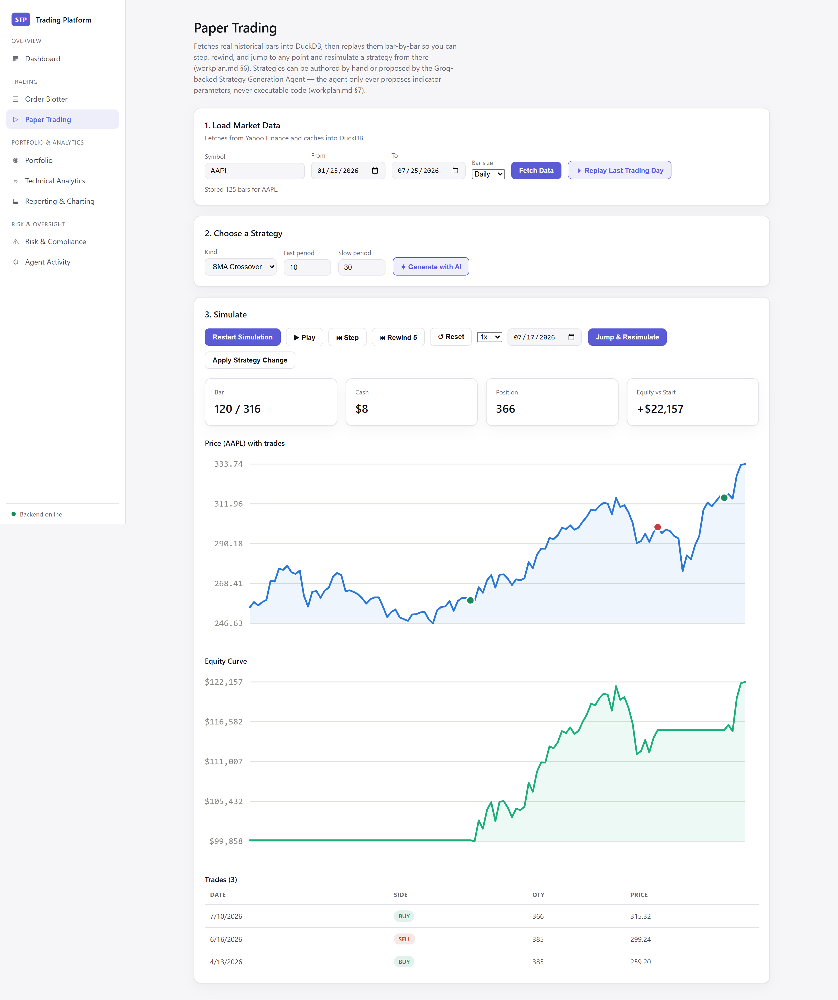

### Risk & Compliance — deterministic risk rules + gen-AI compliance triage

Risk alerts come from deterministic rules run against a live session. Compliance patterns are
detected deterministically too; Groq only drafts the human-readable triage narrative, clearly
labelled `AI DRAFT` and always pending human review.

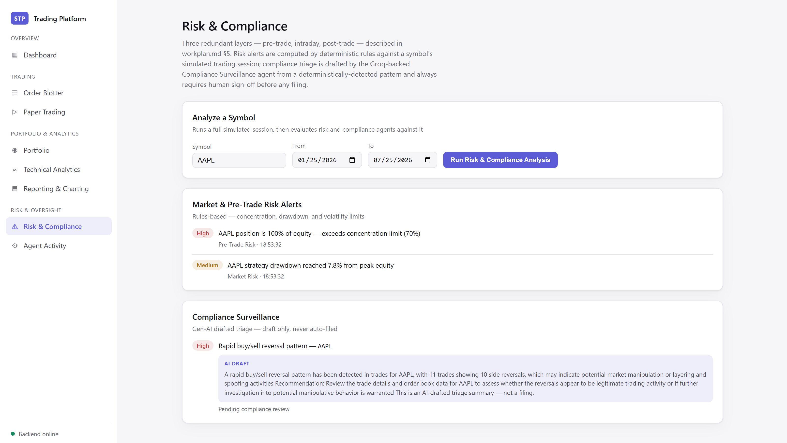

### System Health — live service and trading metrics in the app

Renders `/api/metrics/summary`: uptime, request volume and error rate, latency, memory,
event-loop lag, traffic by route, ingestion and DuckDB query timing, per-agent Groq outcomes and
schema retries, risk/compliance counts, and a live table of replay sessions.

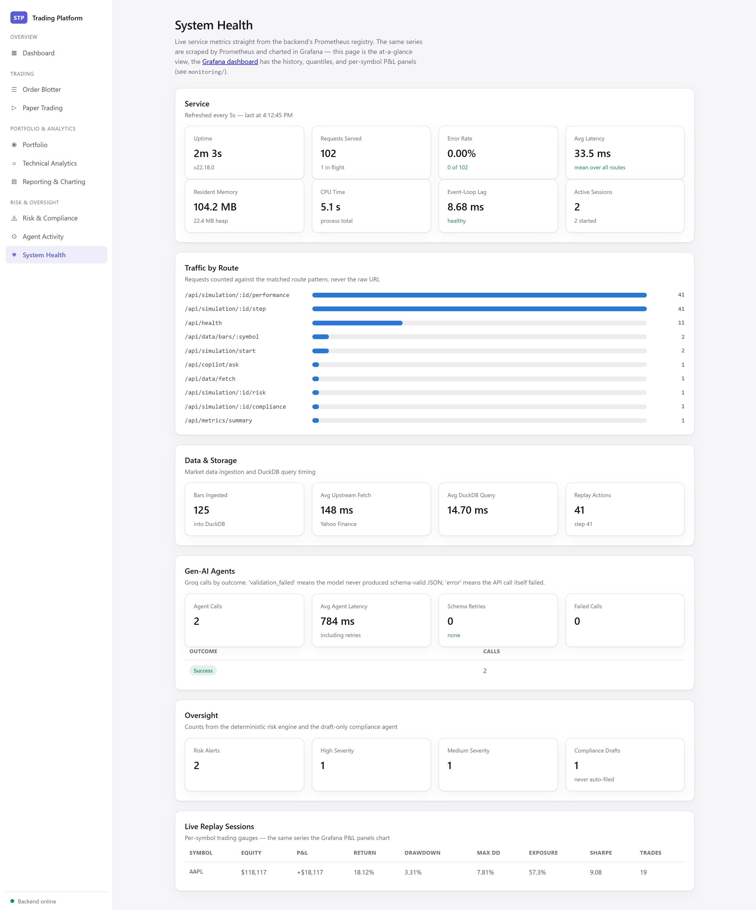

### Grafana — the same metrics over time

One provisioned dashboard, four rows: **paper trading performance** (cumulative P&L, drawdown
from peak, session equity, exposure and trade count, risk alerts); **service health** (request
rate by route, latency quantiles, memory, CPU, event-loop lag, DuckDB query time, per-agent Groq
latency and outcomes including schema retries); **replay engine** (replay latency by strategy
kind, active sessions and action rates, per-symbol return against Sharpe); and **market data,
signals & load** (bars ingested, Yahoo fetch latency by outcome, signals by direction, in-flight
requests). Stepping a replay in the UI moves the P&L panels live.

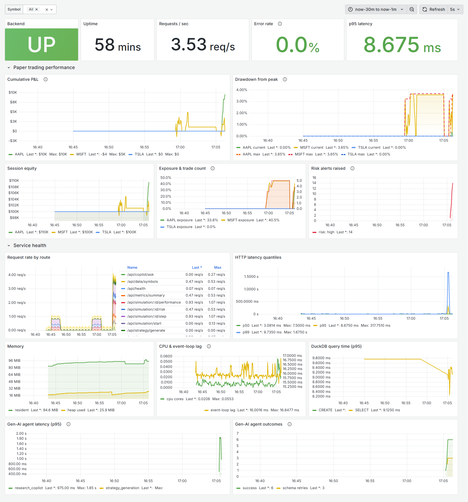

### Technical Analytics — deterministic indicators and signals

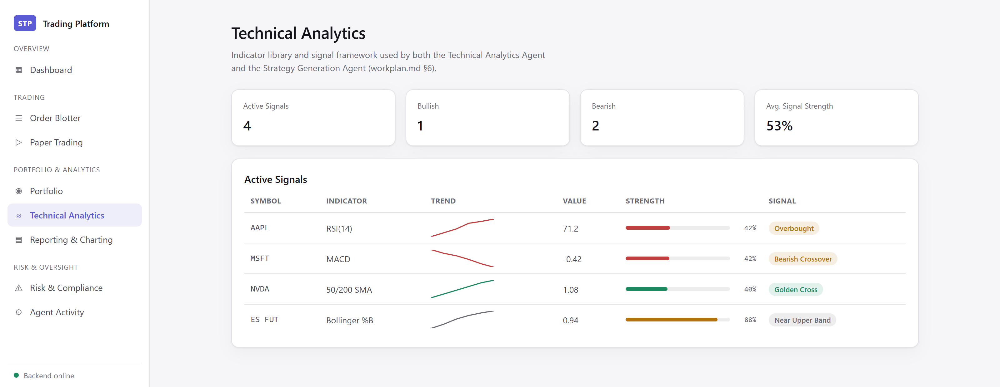

*AAPL has enough history for the 50/200 SMA cross; MSFT and TSLA (105 bars each) don't, so that
indicator is listed under "Not enough history" with the shortfall rather than emitted against a
shorter period.*

### Reporting & Charting — KPIs, exposure charts, and the research copilot

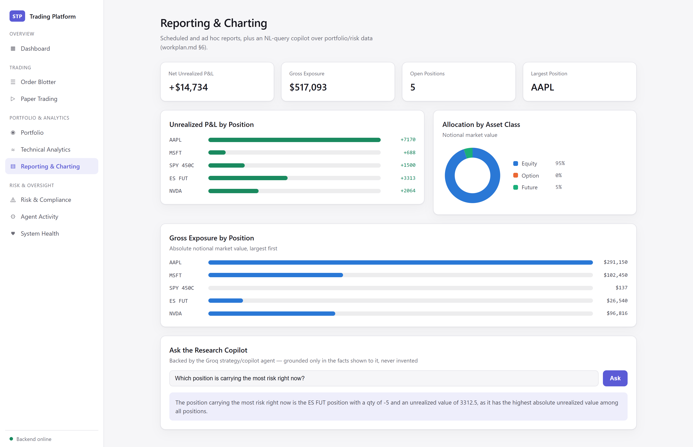

### Dashboard and Agent Activity

| | |
|---|---|
| 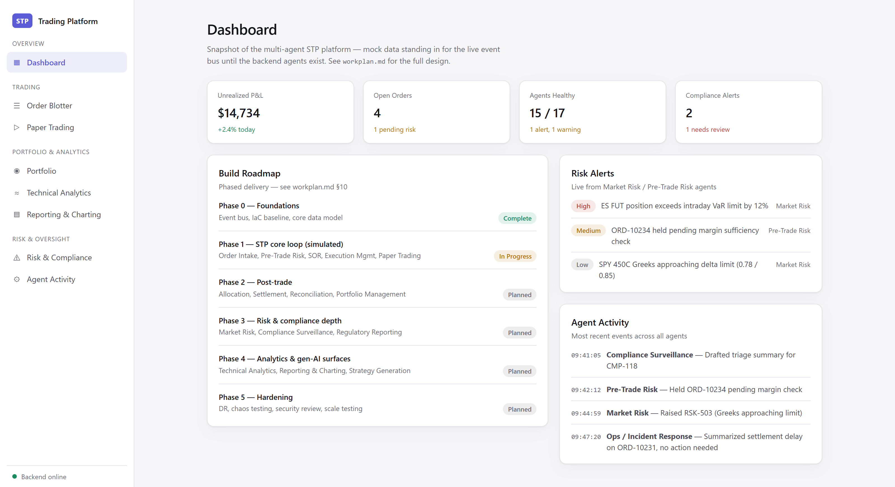 | 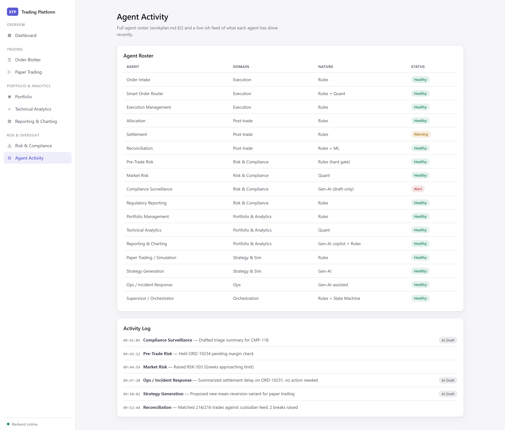 |

### Order Blotter and Portfolio

Still mock-data UI, ahead of the corresponding backend agents.

| | |
|---|---|
| 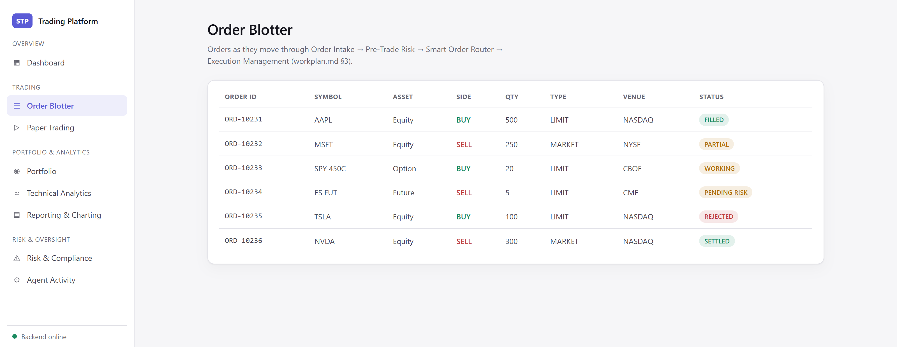 | 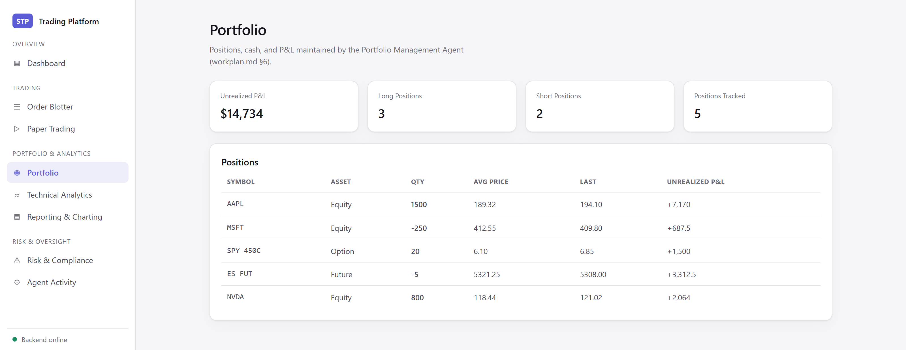 |

---

## Status and known limitations

See `workplan.md` §10 for the original phased roadmap, and
**[docs/t0-production-roadmap.md](./docs/t0-production-roadmap.md)** for the current,
blunt gap list between what runs today and a production-ready T+0 pipeline. Functional end to end today: market data
ingestion and DuckDB storage, bar-by-bar replay and resimulation, performance analytics, the
strategy and copilot Groq agents, rules-based risk evaluation with Groq-drafted compliance
triage, the indicator library and signal generation, and the full observability stack. The
Order Blotter, Portfolio, Dashboard and Agent Activity pages are still mock-data UI ahead of
the corresponding backend agent work.

- Bars for a symbol live in one table regardless of bar size, so fetching both daily and
  5-minute data for the same symbol makes the replay mix granularities. Annualized figures
  detect this and fall back to a daily assumption rather than reporting an inflated Sharpe, but
  the price series itself is still mixed. Use one bar size per symbol.
- Replay sessions and settlement runs live in in-memory stores in the backend process — they
  don't survive a restart and won't work across multiple instances. Both are bounded by a TTL
  and an entry cap (`SESSION_TTL_MS`/`MAX_SESSIONS`,
  `SETTLEMENT_RUN_TTL_MS`/`MAX_SETTLEMENT_RUNS`) and evict least-recently-used, so an idle
  session or an old run can disappear; `DELETE /api/simulation/:id` and
  `DELETE /api/settlement/:runId` release one immediately. A dropped settlement run is
  recoverable — the procedure is deterministic, so re-posting the same request reproduces it.
- The Prometheus trading gauges are labelled by symbol only, so two concurrent sessions on the
  same symbol overwrite each other's values.
