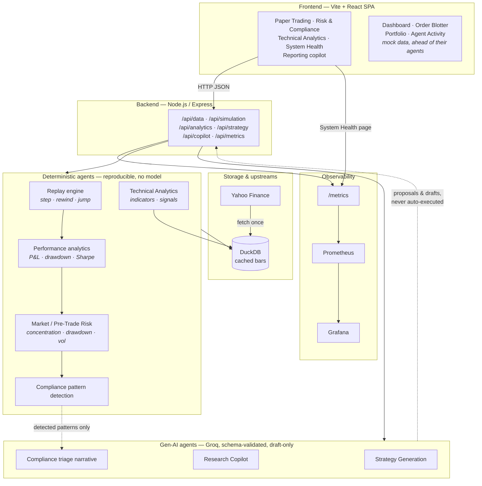

# trading-platform-stp

A design exercise and working scaffold for a multi-agent, gen-AI-assisted straight-through
processing (STP) trading platform covering order execution, portfolio management,
reporting & charting, technical analytics, and paper trading.

## Tech Stack


## Architecture

What is actually built and running today — the full designed agent roster, including the
agents still to be implemented, is in [workplan.md](./workplan.md) §2.



Two properties the diagram is meant to make obvious, both from `workplan.md` §5/§7:

- **Gen-AI never has a write path to anything irreversible.** The Groq agents return
  proposals and drafts through the API; a human accepts them. Compliance patterns are
  detected deterministically first, and the model only writes the narrative explaining an
  alert that code already raised.
- **Everything a number is claimed for is deterministic.** Signals, risk alerts, P&L and
  the replay itself are pure functions of the cached bars, so the same inputs always give
  the same output and any figure on screen can be re-derived.

- **[workplan.md](./workplan.md)** — full architecture and design document: the agent
  roster, trade lifecycle / settlement / risk & compliance workflows, AWS + DevOps
  platform, and phased build roadmap.
- **[backend/](./backend)** — Node.js/Express API: fetches historical (including intraday)
  market data from Yahoo Finance and caches it in DuckDB, replays it bar-by-bar for paper
  trading (step, rewind, jump-to-date/resimulate, or one-click replay of the last trading
  day at 5-minute bars), and runs five agents — two Groq-backed (strategy generation,
  research copilot) that only ever return schema-validated output, a deterministic
  rules-based Market/Pre-Trade Risk agent (concentration, drawdown, volatility limits),
  a Compliance Surveillance agent (deterministic pattern detection, Groq drafts the
  human-readable triage narrative — draft-only, never auto-filed), and a Technical
  Analytics agent (indicator library plus rules-based signal generation, no model at all).
- **[frontend/](./frontend)** — Vite + React (JavaScript) dashboard UI with navigation
  across all major feature areas (dashboard, order blotter, portfolio, risk & compliance,
  reporting, technical analytics, paper trading, agent activity, system health). Paper
  Trading, Risk & Compliance, Technical Analytics, System Health, and the Reporting
  copilot/allocation chart are wired to the real backend; the rest of the UI is still
  backed by mock data matching the shapes described in the workplan.
- **[monitoring/](./monitoring)** — a provisioned Prometheus + Grafana stack in Docker
  Compose. The backend exports both service metrics (HTTP, DuckDB, Groq agents, Node
  runtime) and live trading metrics (equity, P&L, drawdown, exposure, Sharpe per replayed
  symbol), so one dashboard shows whether the platform is healthy *and* what it is doing.

## Screenshots

### Paper Trading — bar-by-bar replay, with P&L and drawdown analytics

Historical bars are fetched into DuckDB and replayed one at a time; you can play, step,
rewind, or jump to a date and resimulate the strategy from there. Trades are marked on the
price chart and tracked against an equity curve, a cumulative P&L chart with a breakeven
baseline, and an underwater drawdown chart — alongside Sharpe, Sortino, volatility, win
rate, profit factor and exposure. All of it is computed deterministically from the equity
curve and trade tape (`backend/src/analytics/performance.js`), and the same numbers are
exported to Prometheus.


### Risk & Compliance — deterministic risk rules + Gen-AI compliance triage

Risk alerts come from deterministic rules (concentration, drawdown, volatility) run against
a simulated session. Compliance patterns are detected deterministically too; Groq only
drafts the human-readable triage narrative, clearly labelled `AI DRAFT` and always pending
human review.


### System Health — live service and trading metrics in the app

Reads the backend's Prometheus registry through a JSON summary endpoint: uptime, request
volume and error rate, latency, memory, event-loop lag, traffic by route, ingestion and
DuckDB query timing, per-agent Groq outcomes and schema retries, risk/compliance counts,
and a live table of replay sessions. It polls every 5s and keeps the last good reading on
screen (labelled as stale) if the backend goes away.


### Grafana — system monitoring and P&L history

The same metrics over time, rather than the current snapshot the in-app page shows. One
dashboard, in four rows:

- **Paper trading performance** — cumulative P&L, drawdown from peak, session equity,
  exposure and trade count, risk alerts.
- **Service health** — request rate by route, latency quantiles, memory, CPU and
  event-loop lag, DuckDB query time, and per-agent Groq latency and outcomes including
  schema retries.
- **Replay engine** — strategy replay latency by strategy kind, replay activity (active
  sessions and the rate of step/rewind/jump/reset/strategy-change actions), and per-symbol
  return against Sharpe ratio.
- **Market data, signals & load** — bars ingested into DuckDB, upstream Yahoo Finance
  fetch latency split by outcome, technical signals by direction, and in-flight requests.

Stepping a replay in the UI moves the P&L panels live.


### Reporting & Charting — KPIs, exposure charts, and the research copilot


### Dashboard


### Agent Activity — the full agent roster and what each one has done


### Technical Analytics — deterministic indicators and signals

RSI, MACD, the 50/200 SMA cross and Bollinger %B computed over the bars already cached in
DuckDB, each with a signal label, a bullish/bearish/neutral direction, and a strength
normalized so the meter is comparable across indicators and across symbols at different
price levels. No model is involved — the same bars always give the same signals.

An indicator the loaded history is too short for is listed separately with the reason
rather than quietly recomputed over a shorter period than its name claims, so a 40-bar
series doesn't silently report something called a "50/200 SMA" cross.


*Every row above is computed from bars cached in DuckDB — AAPL has enough history for the
50/200 SMA cross, MSFT and TSLA (105 bars each) don't, so that indicator is listed under
"Not enough history" with the shortfall rather than emitted against a shorter period.*

### Order Blotter and Portfolio

These two are still mock-data UI ahead of the corresponding backend agents.

| | |
|---|---|
|  |  |

## Running it

Two servers, in separate terminals:

```
cd backend
cp .env.example .env   # then put your GROQ_API_KEY in .env — never commit this file
npm install
npm run dev             # http://localhost:4000
```

```
cd frontend
npm install
npm run dev              # http://localhost:5173 (or next free port)
```

The sidebar shows a live "Backend online/offline" indicator so it's obvious when the
backend isn't running. Paper Trading needs the backend; the rest of the dashboard works
(against mock data) even if it's down.

### Running on a different port

`PORT` and `DUCKDB_PATH` are both read from the environment. **Change them together** —
DuckDB takes an exclusive lock on its file, so a second backend pointed at the same
database exits immediately with `Connection Error: Connection was never established`. That
error means "another process already has this file open", not "the port is busy".

```
cd backend
PORT=4100 DUCKDB_PATH=./data/market-4100.duckdb npm run dev
```

Point the frontend at it with `VITE_API_BASE_URL`, and pick its own port:

```
cd frontend
VITE_API_BASE_URL=http://localhost:4100/api npm run dev -- --port 5180
```

If you move the backend port, update the Prometheus scrape target in
`monitoring/prometheus/prometheus.yml` to match and reload:
`curl -X POST http://localhost:9090/-/reload`.

## Monitoring

The backend exposes Prometheus metrics at `/metrics` (and a JSON rollup at
`/api/metrics/summary`, which is what the in-app System Health page renders). To bring up
the full observability stack:

```
cd monitoring
docker compose up -d
```

| | |
|---|---|
| Grafana | http://localhost:3001 — `admin` / `admin`, anonymous viewing enabled |
| Dashboard | http://localhost:3001/d/stp-platform/stp-trading-platform |
| Prometheus | http://localhost:9090 |

The datasource and dashboard are provisioned from files
(`monitoring/grafana/provisioning/`, `monitoring/grafana/dashboards/`), so the dashboard
lives in git and exists on first boot — no setup wizard, and edits to the JSON are picked
up without restarting the container.

The stack only *observes* the backend; the backend itself runs on the host, which is why
Prometheus scrapes `host.docker.internal:4000` rather than a Compose service name.

**What's instrumented.** Two families of metric, both on the same dashboard:

- *System* — HTTP request rate, error rate and latency quantiles; Node process CPU,
  resident memory, heap and event-loop lag; DuckDB query time by operation; upstream Yahoo
  Finance fetch latency; and per-agent Groq latency and outcomes. Agent outcomes separate
  `validation_failed` (the model never produced schema-valid JSON) from `error` (the API
  call itself failed), so "Groq is down" and "Groq is rambling" don't look alike. Also
  in-flight request concurrency, bars ingested into DuckDB by symbol, and
  `stp_strategy_replay_duration_seconds` — every replay control action re-runs the
  strategy from bar zero, so that is the backend's hottest CPU path and is timed by
  strategy kind.
- *Trading* — per-symbol equity, cumulative P&L, return, current and max drawdown,
  exposure, Sharpe and trade count, republished on every replay action; the count of
  active and started sessions and the replay actions driving them; plus
  technical-analytics signals counted by indicator and direction. Stepping the simulation
  in the UI moves the Grafana P&L chart.

HTTP metrics are labelled with the matched **route pattern**, not the raw URL — replay
paths carry a session UUID, so labelling by URL would mint a new time series per session.

Anonymous access and the default `admin`/`admin` credentials are deliberate for a local
sandbox and should not be carried into a real deployment (see `workplan.md` §9).

## Testing

Both projects use Vitest:

```
cd backend && npm test     # DuckDB storage, simulation engine, and LLM-agent tests
                            # (LLM tests use a mocked Groq client — no API key needed to run them)
cd frontend && npm run test        # run once
cd frontend && npm run test:watch  # watch mode
```

Backend tests cover: DuckDB bar storage/round-trip, the deterministic replay engine
(step/rewind/jump-to-date, including resimulating a strategy from a rewound point), the
Groq agents — including that malformed/invalid LLM JSON is retried and, if it never
resolves, surfaced as a typed `LlmValidationError` rather than silently passed downstream —
and the risk/compliance agents (`riskEngine.js`'s concentration/drawdown/volatility rules,
and `complianceAgent.js`'s deterministic pattern detection plus its Groq-drafted triage
narrative). `strategyAgent.js`, `copilotAgent.js`, and `complianceAgent.js` all validate
model output against a `zod` schema before it's ever used.

They also cover the technical analytics — the indicator library (`indicators.js`:
warm-up windows, EMA seeding, MACD alignment, the zero-width Bollinger band, and ATR
across a price gap) and the signal generator (`signals.js`: crossover labelling on the bar
it happens, direction taken from the MACD line rather than its flattening histogram,
strength normalized per symbol, and short series reported as skipped instead of
recomputed) — the performance analytics (`performance.js` — P&L, drawdown, Sharpe, win
rate, exposure, plus the guards that keep an empty session from dividing by zero and leave
genuinely-undefined metrics null rather than reporting a confident `0`) and the metrics
layer (route-pattern labelling, request/latency/error counting, live P&L gauges, and that a
Groq transport failure is recorded as `error` while a schema failure is recorded as
`validation_failed`).

Frontend tests cover UI components, the error boundary's catch/recover behavior, chart
components (including empty-data, divide-by-zero, and reference-baseline guards), the
System Health page (including that it keeps the last good reading when a refresh fails),
and the API client's handling of network failures and non-2xx responses. Every page-level
route is wrapped in an `ErrorBoundary` (`frontend/src/components/ErrorBoundary.jsx`), keyed
by path, so a crash on one page doesn't take down navigation to the rest of the app.

## Status

See `workplan.md` §10 for the phased roadmap. Paper trading (market data ingestion,
DuckDB storage, bar-by-bar replay/resimulation, performance analytics, and the
strategy/copilot Groq agents), risk & compliance (rules-based risk evaluation plus
Groq-drafted compliance triage, evaluated live against a simulated session), technical
analytics (the indicator library and deterministic signal generation over cached bars), and
observability (Prometheus instrumentation, the System Health page, and the provisioned
Grafana stack) are functional end-to-end; the Order Blotter, Portfolio, Dashboard and Agent
Activity pages are still mock-data-driven UI ahead of the corresponding backend agent work.

Known limitations worth knowing about:

- Bars for a symbol are stored in one table regardless of bar size, so fetching both daily
  and 5-minute data for the same symbol makes the replay mix granularities. Annualized
  figures detect this and fall back to a daily assumption rather than reporting an inflated
  Sharpe, but the price series itself is still a mix. Use one bar size per symbol.
- Replay sessions live in an in-memory map in the backend process, so they don't survive a
  restart and won't work across multiple instances.
- The Prometheus trading gauges are labelled by symbol only. Two concurrent sessions on the
  same symbol overwrite each other's values.
